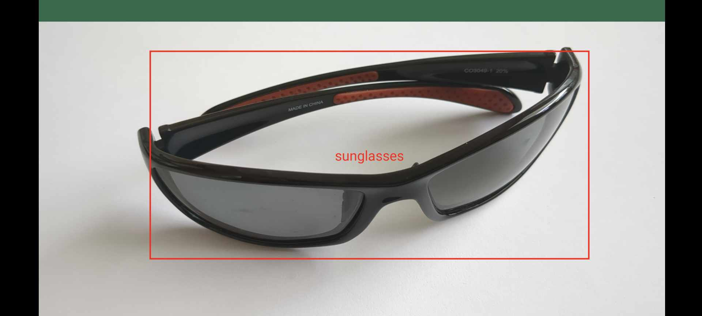

# Object tracking using MLKit and Jetpack Compose

This is a demo project showcasing using MLKit and Jetpack Compose to track objects. It is divided by commits into several parts, so that it is easy to follow the implementation in steps on your own.

## Tutorial

The code is explained in the docs in a step-by-step tutorial. Tutorial consists of 5 steps:
* [Step 1](docs/step_1.md)
* [Step 2](docs/step_2.md)
* [Step 3](docs/step_3.md)
* [Step 4](docs/step_4.md)
* [Step 5](docs/step_5.md)